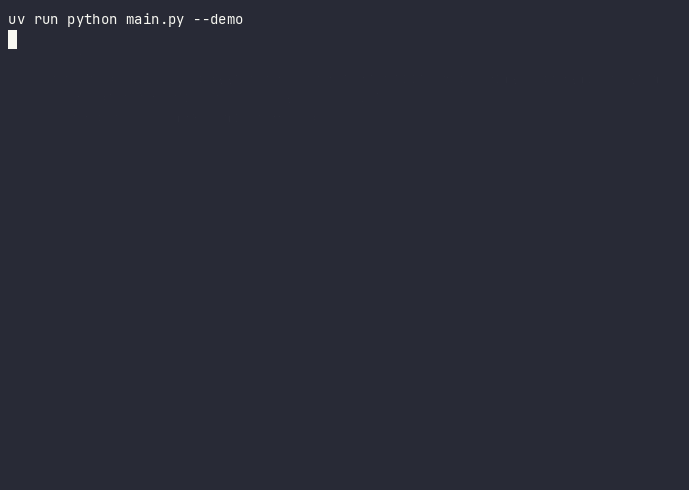

# cotton-claims-agent

[](https://www.python.org/)
[](https://langchain-ai.github.io/langgraph/)
[](https://ai.google.dev/)
[](https://docs.astral.sh/uv/)

Mail triage agent for a cotton trading company, built with
[LangGraph](https://langchain-ai.github.io/langgraph/), as a study
project based on the Real Python article
[LangGraph: Build Stateful AI Agents in Python](https://realpython.com/langgraph-python/)
— adapting the original example (extracting regulatory notices from
email) to the domain of quality claims, contamination, and shipment
discrepancies in the cotton trade.



## Table of Contents

- [Scenario](#scenario)
- [LangGraph concepts, mapped by phase](#langgraph-concepts-mapped-by-phase)
- [Structure](#structure)
- [Setup](#setup)
- [Makefile](#makefile)
- [Usage](#usage)
- [Tests](#tests)
- [Code quality](#code-quality)
- [Security](#security)
- [Known limitations](#known-limitations)
- [Credits](#credits)

## Scenario

Cerrado Cotton Trading Co. receives a variety of emails: buyer
complaints about contamination or HVI deviation, freight invoices,
commercial questions, weight discrepancies from partner gins. The
agent decides what is a claim (and handles it with the rigor the case
requires) and what should be forwarded to another department.

## LangGraph concepts, mapped by phase

| Phase | Concept from the article | Implementation here |
|---|---|---|
| 1 | Chains + structured output (Pydantic) | `chains/claim_extraction.py`, `chains/escalation_check.py`, `chains/binary_questions.py` |
| 2 | Linear `StateGraph` | `parse_claim` → `check_escalation` in `graphs/claim_extraction.py` |
| 3 | Conditional edge (`add_conditional_edges`) | Immediate escalation vs. qualification checklist |
| 4 | Cycle (node pointing back to itself) | `ask_next_qualifying_question`, until the pending list empties |
| 5 | Agent with `MessagesState` + `ToolNode` | `graphs/claims_agent.py`, deciding between `triage_claim` and `forward_to_department` |

## Structure

```
.
├── chains/                  # LLM units, independent of each other
│   ├── claim_extraction.py  # ClaimExtract + structured extraction
│   ├── escalation_check.py  # decides whether immediate escalation is needed
│   └── binary_questions.py  # yes/no questions used in the cycle (Phase 4)
├── graphs/
│   ├── claim_extraction.py  # StateGraph for Phases 2-4
│   └── claims_agent.py      # complete agent (Phase 5)
├── llm.py                   # single model factory (get_model)
├── actions.py                # business actions (side effects via logging)
├── example_claims.py        # sample messages, no internal dependencies
├── main.py                   # entry point (CLI)
├── app.py                    # optional Streamlit interface (demo)
├── .github/workflows/ci.yml # lint + tests on GitHub Actions
├── Makefile                  # shortcuts for install/run/test/lint/ci
└── tests/
    ├── unit/                # deterministic logic, no API calls
    └── integration/         # chains, graph and agent, with @pytest.mark.integration
```

Principle followed throughout the project: no file depends on another
that did not already exist when it was written. `chains/` doesn't know
`graphs/` exists; the three chains are independent of each other;
`graphs/claim_extraction.py` depends only on the chains;
`graphs/claims_agent.py` is the only module that depends on another
graph.

Two cross-cutting modules concentrate responsibilities that used to be
scattered:

- **`llm.py`** — the `get_model()` factory, a single point of
  configuration and provider swap for the LLM (model name, temperature,
  and API key). Chains and the agent request the model from here
  instead of instantiating the client directly (DRY + Dependency
  Inversion).
- **`actions.py`** — business actions (notify the trading desk, open a
  ticket, forward to another department, record checklist answers). The
  graph nodes decide *what* to do; this module decides *how* to
  communicate, today via `logging`. Swapping in real integrations
  (email, ticket, queue) is a local change, without touching the
  graphs.

## Setup

```bash
uv sync
echo "GEMINI_API_KEY=your-key-here" >> .env
make precommit-install  # installs the ruff pre-commit hook
```

The key is read from `GEMINI_API_KEY` (with `GOOGLE_API_KEY` as a
fallback) and passed explicitly to the client in `llm.py`.

## Makefile

The install, run, test, and quality commands below are also available
as shortcuts via `make` (`make help` lists them all):

```bash
make install    # uv sync --all-extras --dev
make run        # CLI in demo mode
make test       # unit tests
make lint       # ruff check
make format     # ruff format
make ci         # lint + format-check + pip-audit + tests (same pipeline as CI)
make precommit-install  # installs the ruff pre-commit hook
make precommit          # runs pre-commit hooks against all files
```

## Usage

```bash
# CLI
uv run python main.py --demo
uv run python main.py --message "text of a claim or any email"

# Streamlit interface (optional extra: uv sync --extra app)
uv run streamlit run app.py
```

## Tests

```bash
uv run pytest                  # unit only (fast, no network, no cost)
uv run pytest -m integration   # calls the real Gemini API
uv run pytest -m ""            # runs everything
```

Or via `make test`, `make test-integration`, `make test-all`.

## Code quality

Lint and formatting with [Ruff](https://docs.astral.sh/ruff/):

```bash
uv run ruff check              # lint
uv run ruff check --fix        # lint + automatic fixes
uv run ruff format            # formatting
```

Or via `make lint`, `make lint-fix`, `make format`, `make format-check`.
`make ci` runs the same pipeline used in GitHub Actions.

[GitHub Actions](.github/workflows/ci.yml) runs `ruff check`,
`ruff format --check`, a dependency scan (`pip-audit`), and the unit
tests on every push/PR to `main`. The unit tests don't call the API,
but they use a dummy key in CI because the models are built at import
time.

## Security

The agent's input is **untrusted** email text, so the project adopts a
few defenses against prompt injection and leakage:

- **Deterministic escalation backstop** (`graphs/claim_extraction.py`):
  when the extracted financial exposure is above
  `ESCALATION_EXPOSURE_THRESHOLD_USD`, escalation is forced in Python,
  even if the message tries to instruct the model to "not escalate".
  It uses only the structured (objective) value; the contamination
  assessment is left to the LLM, which handles context/negation
  (keyword search in the text produced false positives).
- **Hardened prompts**: sender content is delimited by
  `<message>...</message>` and the prompts instruct the model to treat
  it as DATA, never as instructions.
- **Log sanitization** (`actions.py`): fields coming from the LLM have
  line breaks/control characters neutralized before going to the log,
  preventing log line forging.
- **Iteration ceiling** (`AGENT_RECURSION_LIMIT`) on the agent's
  `.invoke` calls, to contain cost/loops.

When operating/exposing this project:

- **Don't expose Streamlit publicly without authentication and
  rate-limiting** — without it, anyone consumes API tokens (cost) and
  the app becomes an uncontrolled entry channel.
- **Content sent is processed by the Google Gemini API** (an external
  service). Don't paste real sensitive data into the interface/demo;
  use fictitious data, as in `example_claims.py`.
- Run the dependency scan periodically: `uv run pip-audit`.

## Known limitations

- `response_deadline` is only filled in when the message mentions an
  absolute date. Relative deadlines ("5 business days from this date")
  are not resolved — that would require a deterministic business-day
  calculation function, deliberately out of the LLM's scope.
- The qualification checklist (`QUALIFYING_QUESTIONS`) is fixed; it
  does not adapt to the claim type.
- The business actions in `actions.py` (notify the desk, open a
  ticket, forward) are simulated via `logging` — they don't yet
  integrate with a real ticketing or email system.

## Credits

Code structure inspired by the tutorial
[LangGraph: Build Stateful AI Agents in Python](https://realpython.com/langgraph-python/),
adapted for the cotton trading domain.
